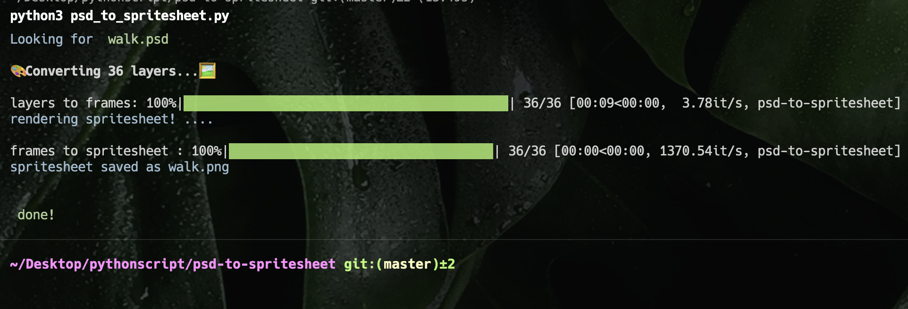

# PSD Spritesheet Utility



Requirements:

- Python 3 (installed with pip & pyenv)

```
    from psd_tools import PSDImage
    from PIL import Image
    from time import sleep
    from tqdm import tqdm
```

Install dependencies one by one `python3 -m pip install psd_tools`, etc.

OR install all via txt file. `pip install -r libs.txt`

## `psd_to_spritesheet.py`

Converts a multi-layered `.psd` into a horizontal spritesheet. Output is a `.png`

Example:

```
python psd_to_spritesheet.py
```

change line 14 to be the name of your psd, `psd_name = "walk"`
